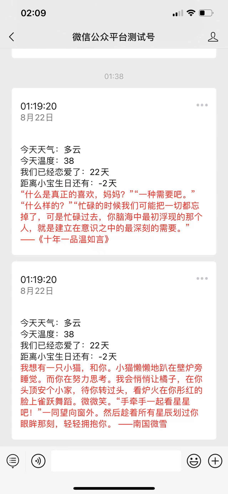

# 微信公众号-天气

#### 介绍
模仿抖音上的给女朋友发送天气的小程序

#### 弄之前必备的东西，如果没有的话，就不用下载了。
1.服务器或者能运行php的虚拟空间。

2 知道 1 写的是什么的人。

3.一个微信公众号，如果没有的话可以用微信公众号测试号代替。

#### 安装教程

1.  下载此php文件，放置服务器中。
2.  定时运行

#### 使用说明

1.  下载此php到服务器中。
2.  更换天气api为自己的(http://www.tianqiapi.com/)(调用次数有限制，怕失效)。
3.  更换情话api为自己的(https://www.free-api.com/)(调用次数有限制，怕失效)。
4.  恋爱时间$lovestart = strtotime('2022-08-01');   改为自己的，格式别错了
5.  生日时间$birthdaystart = strtotime('2022-08-25'); 改为自己的，格式别错了。
6.  登录微信公众号或者微信公众号测试平台，这里我以公众号测试号平台为例。
    
6.1 https://mp.weixin.qq.com/debug/cgi-bin/sandbox?t=sandbox/login 到浏览器里打开，然后点击扫码登录

    6.2  **复制appID和appsecret到php代码里进行替换。** 

    6.3 创建模板消息

    6.4 将下面的代码复制到模板内容里
        {{first.DATA}}
        今天天气：{{keyword1.DATA}}
        今天温度：{{keyword2.DATA}}
        我们已经恋爱了：{{keyword3.DATA}}
        距离小宝生日还有：{{keyword4.DATA}}
        {{remark.DATA}}
    6.5 填写好标题后保存

    6.6  **将模板id复制到代码里** 

    6.7  **然后让你女朋友关注这个微信公众号测试号，获取她的微信号,然后复制到代码里** 

7.定时运行php(找个网站监控或者网址监控就可以定时运行)

 **如果上面还不会的，可以去我抖音上留言或私信我。我再细化教程** 

#### 参与贡献

1.  Fork 本仓库
2.  新建 Feat_xxx 分支
3.  提交代码
4.  新建 Pull Request

#### 特技

1.  使用 Readme\_XXX.md 来支持不同的语言，例如 Readme\_en.md, Readme\_zh.md
2.  Gitee 官方博客 [blog.gitee.com](https://blog.gitee.com)
3.  你可以 [https://gitee.com/explore](https://gitee.com/explore) 这个地址来了解 Gitee 上的优秀开源项目
4.  [GVP](https://gitee.com/gvp) 全称是 Gitee 最有价值开源项目，是综合评定出的优秀开源项目
5.  Gitee 官方提供的使用手册 [https://gitee.com/help](https://gitee.com/help)
6.  Gitee 封面人物是一档用来展示 Gitee 会员风采的栏目 [https://gitee.com/gitee-stars/](https://gitee.com/gitee-stars/)
